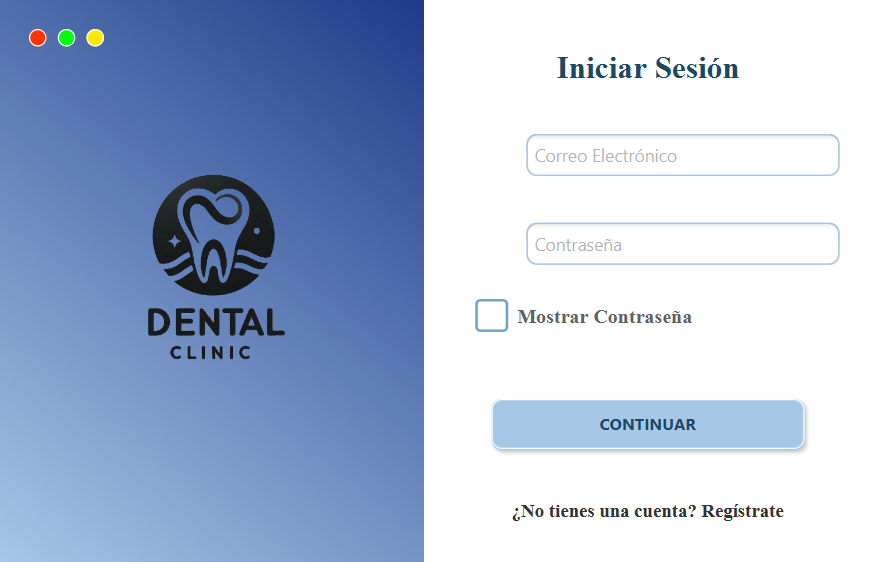
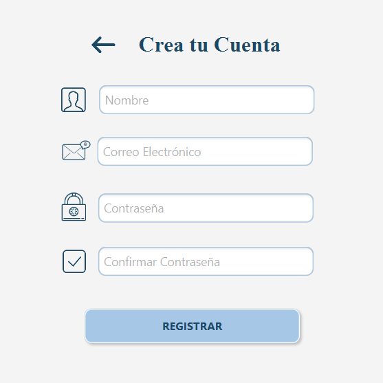
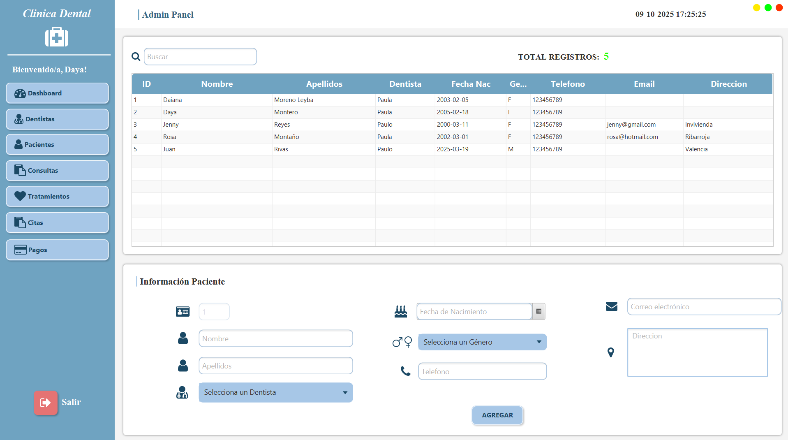

# 🏥 Sistema de Gestión de Clínica Dental

## Descripción

Aplicación de escritorio para la gestión de clínicas dentales que permite administrar pacientes, dentistas, citas, tratamientos y facturación desde una interfaz gráfica desarrollada con **JavaFX**.

---

## Objetivos

- Desarrollar una aplicación de escritorio profesional para gestión clínica.
- Aplicar arquitectura en capas con **Spring Boot**.
- Implementar el **patrón DAO** (Data Access Object) para acceso a datos.
- Utilizar **Hibernate/JPA** para la persistencia.
- Crear una interfaz gráfica intuitiva con **JavaFX**.

---

## Funcionalidades

- Sistema de **autenticación** de usuarios con control de acceso.
- Gestión completa de **dentistas** con especialidades y número de colegiado.
- Gestión de **pacientes** con asignación de dentista y datos de contacto.
- Programación de **citas** con asignación de dentista, sala y tratamiento.
- Registro de **tratamientos** por paciente con seguimiento de estado.
- Control de **consultorios** y disponibilidad de salas.
- Generación de **facturas** por tratamiento con múltiples métodos de pago.

---

## Capturas de pantalla

### Pantalla de Login


### Pantalla de Registro


### Gestión de Pacientes


---

## Stack tecnológico

- **Backend:** Java 17, Spring Boot 3.4.3, Hibernate/JPA
- **Patrón de diseño:** DAO (Data Access Object), MVC (Modelo-Vista-Controlador)
- **Frontend:** JavaFX, FXML
- **Base de Datos:** PostgreSQL
- **Librerías adicionales:** FontAwesome, AnimateFX, Log4j2
- **Gestión:** Maven
- **Control de versiones:** Git y GitHub

---

## Instalación

### Requisitos

- Java 17+
- PostgreSQL 12+
- Maven 3.6+
- IDE (recomendado: IntelliJ IDEA o Eclipse)

### Configuración

1. **Clonar el repositorio:**
```bash
git clone https://github.com/DayanaraMontero/dental-clinic-management.git
cd dental-clinic-management
```

2. **Crear base de datos:**
```sql
CREATE DATABASE clinica;
```

3. **Configurar application.properties:**
```properties
spring.datasource.url=jdbc:postgresql://localhost:5432/clinica
spring.datasource.driver-class-name=org.postgresql.Driver
spring.datasource.username=tu_usuario
spring.datasource.password=tu_contraseña
spring.jpa.hibernate.ddl-auto=update
spring.jpa.show-sql=true
```

4. **Compilar y ejecutar**

**Opción A - Con Maven:**
```bash
mvn clean install
mvn spring-boot:run
```

**Opción B - Desde IDE:**

- Importar proyecto como proyecto **Maven**.
- Esperar a que descargue dependencias
- Ejecutar clase **Main.java**.

---

## Estructura del proyecto
```
ClinicaDental/
├── .idea/                      # Configuración de IntelliJ IDEA
├── .mvn/                       # Maven wrapper
├── javafx-sdk-17.0.14/         # JavaFX SDK
├── src/
│   ├── main/
│   │   ├── java/
│   │   │   └── es.cheste.ClinicaDental/
│   │   │       ├── config/              # Configuraciones de Spring
│   │   │       ├── controladores_cliente/  # Controladores REST
│   │   │       ├── controladores_fx/    # Controladores JavaFX (Vista)
│   │   │       ├── entidades/          # Entidades JPA (Modelo)
│   │   │       │   ├── Cita.java
│   │   │       │   ├── Consulta.java
│   │   │       │   ├── Dentista.java
│   │   │       │   ├── Factura.java
│   │   │       │   ├── Paciente.java
│   │   │       │   ├── Tratamiento.java
│   │   │       │   └── Usuario.java
│   │   │       ├── enums/              # Enumerados: EstadoCita, Especialidad, Genero, etc.
│   │   │       ├── excepcion/          # Manejo de excepciones
│   │   │       ├── interfaces/         # Interfaces DAO (Patrón DAO)
│   │   │       │   ├── CitaDAO.java
│   │   │       │   ├── ConsultaDAO.java
│   │   │       │   ├── DentistaDAO.java
│   │   │       │   ├── FacturaDAO.java
│   │   │       │   ├── PacienteDAO.java
│   │   │       │   ├── TratamientoDAO.java
│   │   │       │   └── UsuarioDAO.java
│   │   │       ├── impl/               # Implementaciones DAO
│   │   │       │   ├── CitaDAOImpl.java
│   │   │       │   ├── ConsultaDAOImpl.java
│   │   │       │   ├── DentistaDAOImpl.java
│   │   │       │   ├── FacturaDAOImpl.java
│   │   │       │   ├── PacienteDAOImpl.java
│   │   │       │   ├── TratamientoDAOImpl.java
│   │   │       │   └── UsuarioDAOImpl.java
│   │   │       ├── repositorios/       # Repositorios Spring Data JPA
│   │   │       ├── servicios/          # Lógica de negocio
│   │   │       └── Main.java           # Clase principal
│   │   └── resources/
│   │       ├── css/                    # Hojas de estilo
│   │       ├── img/                    # Imágenes e iconos
│   │       ├── static/                 # Recursos estáticos
│   │       ├── templates/              # Plantillas FXML
│   │       ├── vista/                  # Vistas adicionales
│   │       └── application.properties  # Configuración Spring Boot
│   └── test/                           # Tests unitarios
├── target/                     # Compilación de Maven
├── .gitattributes             # Atributos de Git
├── .gitignore                 # Archivos ignorados por Git
├── HELP.md                    # Ayuda de Spring Boot
├── mvnw                       # Maven wrapper (Unix)
├── mvnw.cmd                   # Maven wrapper (Windows)
├── pom.xml                    # Configuración de Maven
└── README.md                  # Este archivo
```

---

## Licencia
Proyecto desarrollado con fines educativos como parte del ciclo **Desarrollo de Aplicaciones Multiplataforma** en el **CIPFP Cheste, 2025.**


